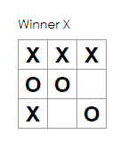

# 🎁 Tic tac react
Basic tic tac toe game designed with react and with the help of a tutorial on the official website of react.

## 🎹 Functionalities
<ol>
  <li>Lets you play tic-tac-toe.</li>
  <li>Indicates when a player has won the game.</li>
  <li>Stores a game’s history as a game progresses.</li>
  <li>Allows players to review a game’s history and see previous versions of a game’s board.</li>
</ol>

## 🎃 Screenshoots

  
  
A tic tac toe game with an historial buttons list

